# HyperAuth OIDC 연동


## 1. HyperAuth 설정
    
1. HyperAuth에 접속
   
2. Hypercloud가 클라이언트로 등록된 Realm 선택 

3. 클라이언트 스코프 생성

   1. Client Scopes > Create
   2. 이름 입력 후 Save
    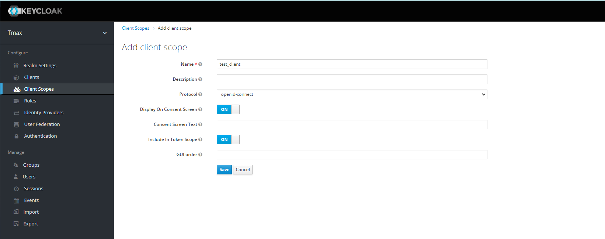
    
   3. Mappers 탭에서 Create
    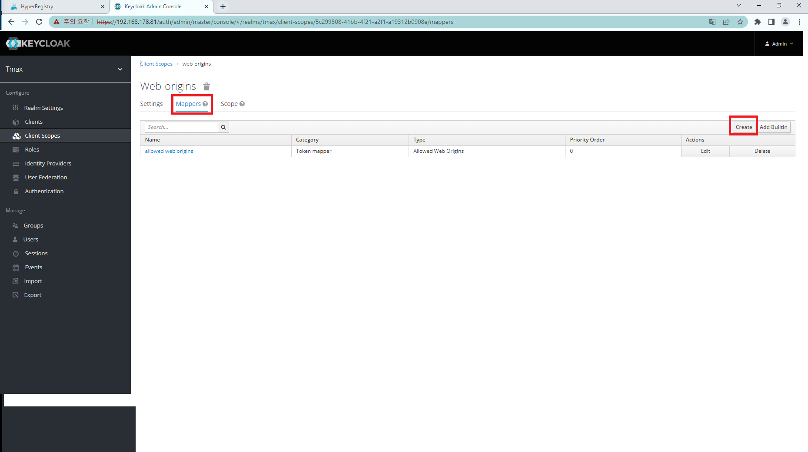
    
   4. 다음의 내용으로 생성
      - Name: group
      - Mapper Type: Group Membership
      - Token Claim Name: **group**
      - Add to ID token: On
      - Add to access token: On
      - Add to userinfo: On
    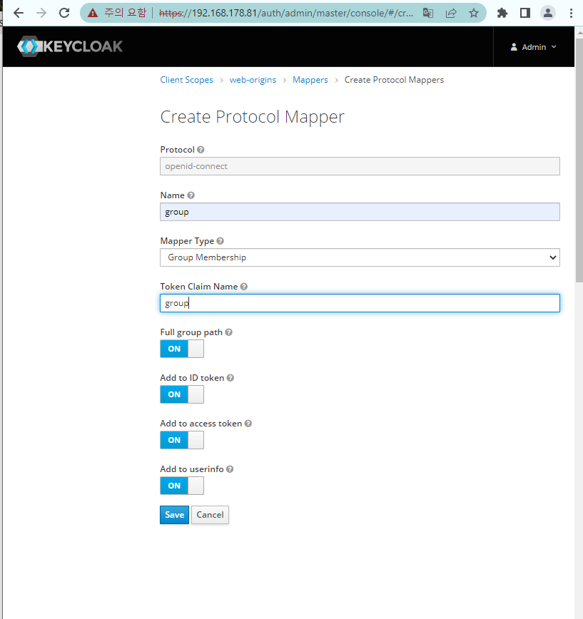
    
    
4. 클라이언트 생성

   1. Clients > Create
   2. Client ID 입력(2.4의 [clientID]), Client Protocol = openid-connect 선택 
   3. Save 클릭
    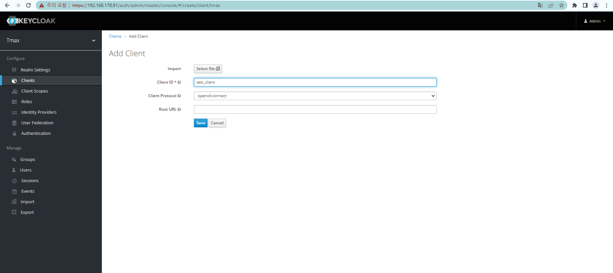
    
5. 클라이언트 설정
   1. 생성한 Client 클릭을 합니다
   2. Access Type: confidential 선택
   3. Valid Redirect URIs 입력 
      ```bash
      # https://{hyperregistry_address}/c/oidc/callback  (2.3 화면에서 save 버튼 위에 나타난 URL)
      https://{hyperregistry_address}/c/oidc/callback 
      ```
   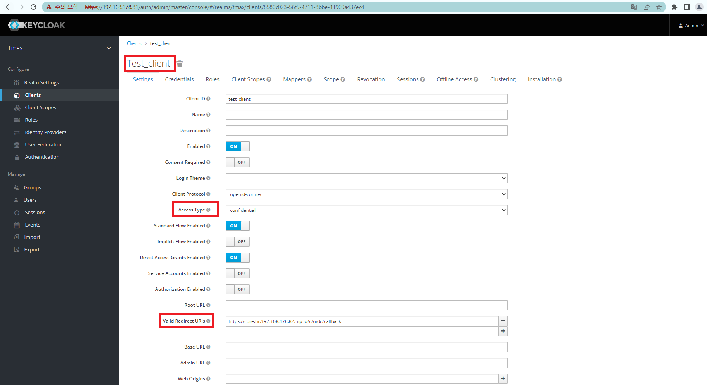
   
   4. (생성된) Credentials 탭에서 Secret 값 복사 (2.4의 [secret])
   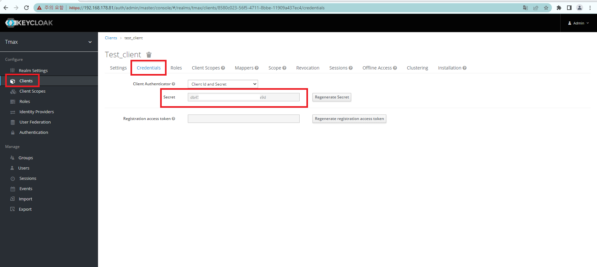
   
   5. Client Scopes > Default Client Scopes에서 3.2에서 생성한 이름 클릭 후 Add selected 클릭 
   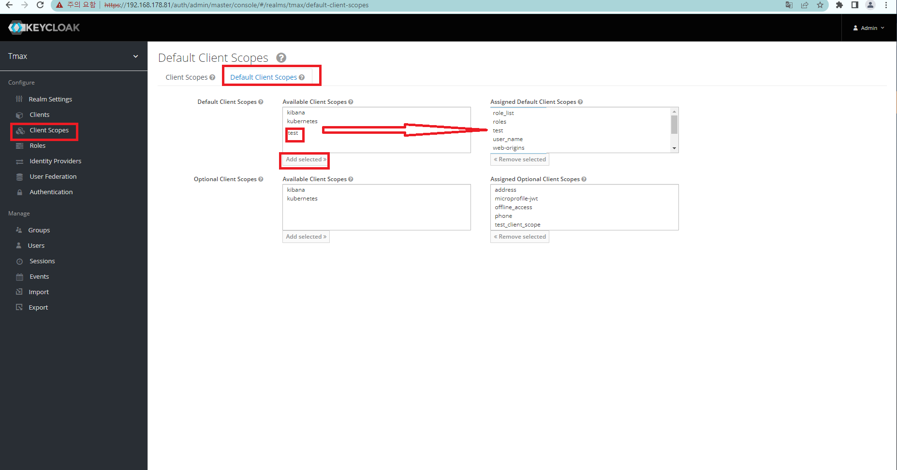
   
6. 그룹 생성

   1. Groups > New
   2. 그룹명 입력 후 Save
    <br><br><br>


7. 사용자 생성 및 생성한 그룹에 추가 <br>
   (First Name, Last Name를 설정하지 않으면 OIDC 레지스트리 로그인이 안될 수 있습니다 **최하단 비고부분의 사진참고**)
   
   1. Add user 클릭
   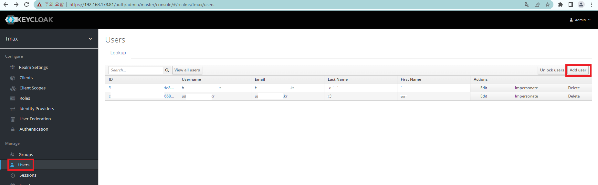
   <br>
   
   2. Username, Email, First Name, Last Name 입력 
   3. Email Verfieid On 선택 후 Save
   4. Createndtials 탭에서 Password, Password Confirmation 입력
   5. Temporary Off 선택 후 Set Password
   <br>
   
   6. Groups > Available Groups에서 **6번(그룹생성)** 에서 생성한 그룹 선택 후 Join
   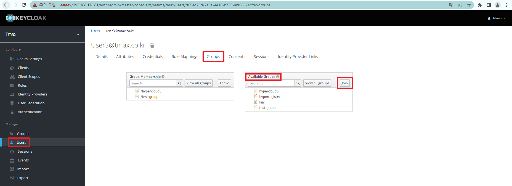
   <br>
   
## 2. HyperRegistry에 설정하기

1. HyperRegistry 접속 및 관리자 로그인(admin/ admin)
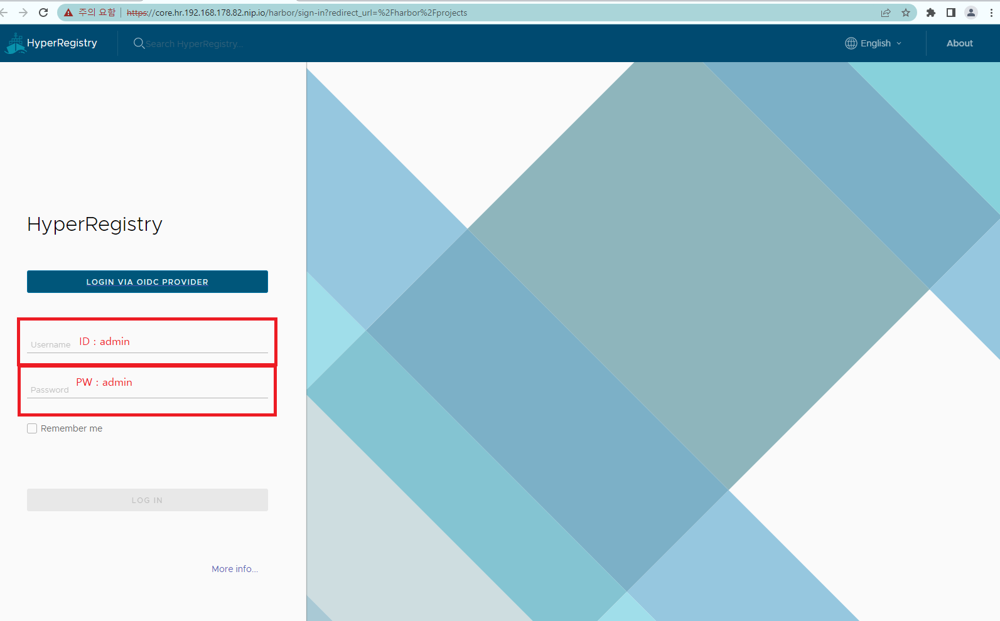

2. (LNB) Administration > Configuration 클릭

- Auth Mode: OIDC 선택
- OIDC Endpoint: (ex: https://{hyperauth.org}/auth/realms/[realm] ) 
- OIDC Client ID: [clientID]
- OIDC Client Secret: [secret]
- Group Claim Name: **group** (HyperAuth에서_생성한_group_mapper명)
- OIDC Admin Group: **hyperregistry** (HyperAuth에서_생성한_그룹명)
- OIDC Scope: openid
- Automatic onboarding 체크
- Username Claim: name
- Test OIDC SERVER 클릭하여 연결 여부 확인 후 Save

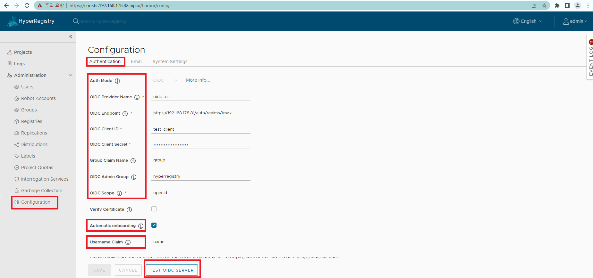

<br><br><br><br>


    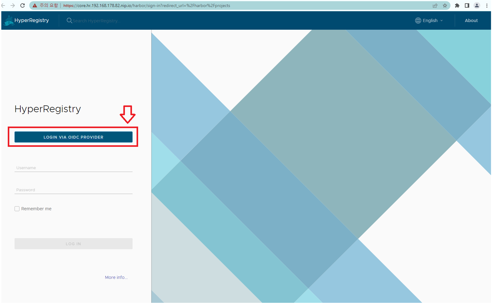

    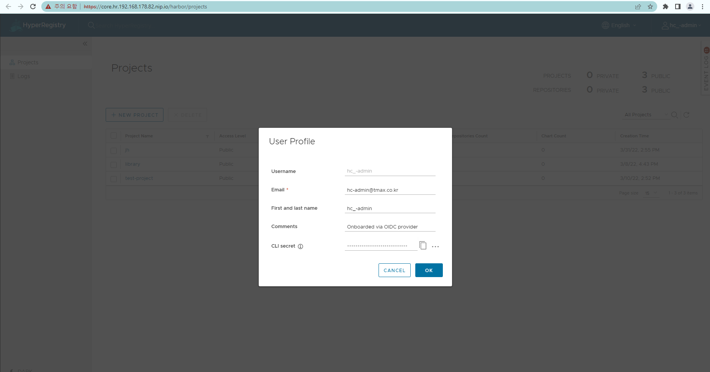


    

    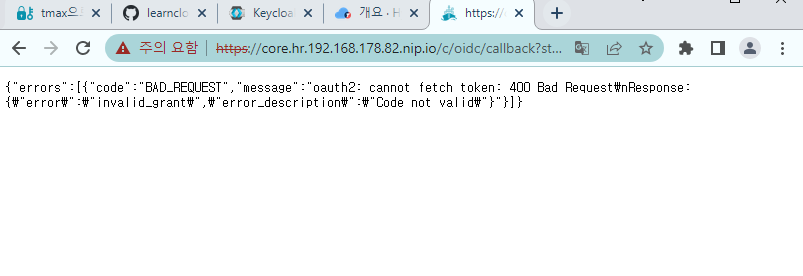


